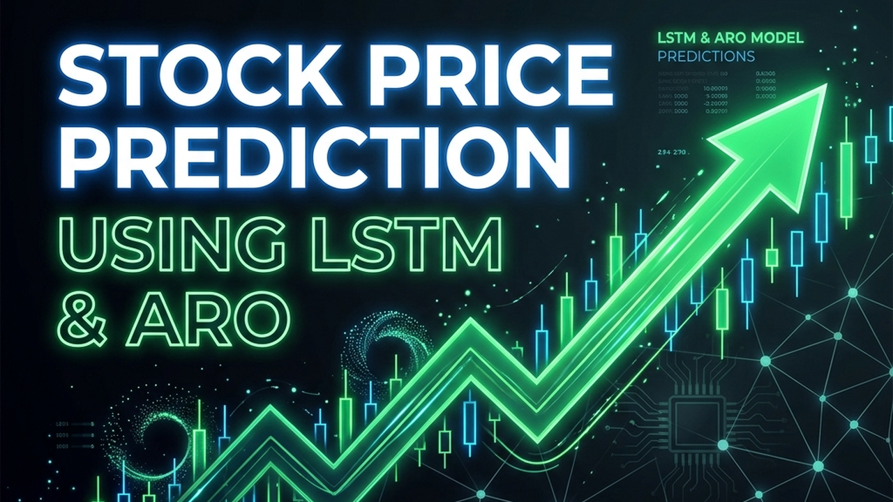
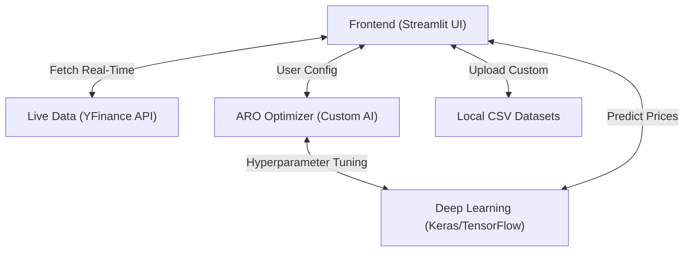

# 📈 Stock Predictor Pro: AI-Powered Price Forecasting & Analysis

<div align="center">
  
  <br />
  <br />
  <h3>
    <a href="https://youtu.be/vMU10v0oZMo">🎥 Watch the Live Demo</a>
    <span> | </span>
    <a href="https://www.linkedin.com/in/naila-bibi-62a2863a7">💼 Connect on LinkedIn</a>
  </h3>
</div>

<p align="center">
  <strong>A premium, enterprise-grade financial dashboard featuring Deep Learning (LSTM), Artificial Rabbit Optimization (ARO), and Multi-Stock comparative forecasting.</strong>
</p>

---

## 🚀 Mission Statement

Stock Predictor Pro is designed to revolutionize how investors and analysts interact with market data. Built with a focus on high-end Bloomberg-style aesthetics, real-time data fetching, and advanced Machine Learning algorithms, it eliminates guesswork, optimizes hyperparameter tuning dynamically, and provides highly accurate future price predictions.

## 🏗️ System Architecture



---

## ✨ Core Modules & Features

### 📉 1. Advanced Single Stock Analysis
- **Smart Data Integration:** Instantly fetch live market data using YFinance or upload custom offline CSV datasets.
- **Interactive Technical Indicators:** Highly responsive charts featuring Candlesticks, 20-day Simple & Exponential Moving Averages (SMA/EMA), RSI, and MACD indicators.
- **Deep Learning Engine:** Long Short-Term Memory (LSTM) neural network specifically designed for volatile time-series financial data.
- **Artificial Rabbit Optimization (ARO):** Nature-inspired hyperparameter optimization algorithm that automatically tunes network units, dropout, epochs, and batch sizes to guarantee minimal error margins.
- **30-Day Future Forecasting:** Predicts the next 30 days of market movement with detailed day-by-day tables, buy/sell signal generation, and a robust 95% Confidence Band.

### 📊 2. Multi-Stock Comparison Engine
- **Historical Percentage Growth:** Normalized zero-based comparison charts allowing direct performance benchmarking across multiple giant tech stocks simultaneously (e.g., AAPL vs MSFT vs GOOGL).
- **Stock Correlation Heatmap:** Advanced correlation matrices (1.0 to -1.0) to assist investors in identifying inversely related assets for effective portfolio diversification.
- **Fast 30-Day Comparative Forecast:** A high-speed, lightweight LSTM processing pipeline that runs predictions across all selected stocks in parallel for quick directional trend spotting.

---

## 🛠️ Technology Stack

| Layer | Technologies |
| :--- | :--- |
| **Frontend UI** | Streamlit, Streamlit-Lottie |
| **Data Processing** | Pandas, Numpy, Scikit-learn (MinMaxScaler) |
| **Deep Learning** | TensorFlow / Keras (LSTM) |
| **Data Visualization** | Plotly (Interactive Graph Objects, Subplots) |
| **External APIs** | Yahoo Finance (yfinance) |

---

## 📂 Project Structure

```text
/stock-price-prediction-lstm-aro
├── app.py                      # Main Streamlit Application & unified routing
├── /models
│   └── lstm_model.py           # TensorFlow LSTM Architecture
├── /optimization
│   └── aro_optimizer.py        # Artificial Rabbit Optimization Algorithm
├── /utils
│   ├── metrics.py              # MAE, MSE, RMSE calculation functions
│   ├── plot.py                 # Plotly visualization components
│   └── preprocessing.py        # Data scaling and forecast shaping
├── /data                       # Sample offline datasets
├── requirements.txt            # Python dependencies
└── thank_you_1280x720.png      # Dashboard Banner Image
```

---

## ⚙️ Installation & Local Setup

### Prerequisites
- **Python** (v3.9+)
- **Git** (Version control)

### 1. Clone & Environment Setup
```bash
git clone https://github.com/NailaKhani/stock-price-prediction-lstm-aro.git
cd stock-price-prediction-lstm-aro

# Create and activate virtual environment
python -m venv venv
# On Windows: venv\Scripts\activate
# On Mac/Linux: source venv/bin/activate
```

### 2. Install Dependencies
```bash
pip install -r requirements.txt
```

### 3. Launch the Platform
```bash
streamlit run app.py
# Runs automatically on http://localhost:8501
```

---

## 🎨 Design Philosophy & UX

Stock Predictor Pro utilizes an **Enterprise Dashboard** aesthetic designed to look professional out-of-the-box:
- **Dark Mode Native:** Deep slate/navy foundations (`#16213e`) for visual comfort and high-end feel.
- **Semantic Accents:** 
  - 🔵 **Cyan/Blue** for Actual Market Prices and core structural elements.
  - 🔴 **Red/Pink** for Model Test Predictions.
  - 🟡 **Amber/Gold** for Future Forecasting and Confidence Bands.
- **Bloomberg-Terminal Inspired:** Clean typography, grid layouts, and absolute zero reliance on emojis within data presentations.

---

### Contact Information
- **Email:** nailakhani5457@gmail.com
- **LinkedIn:** [Naila Bibi](https://www.linkedin.com/in/naila-bibi-62a2863a7)
